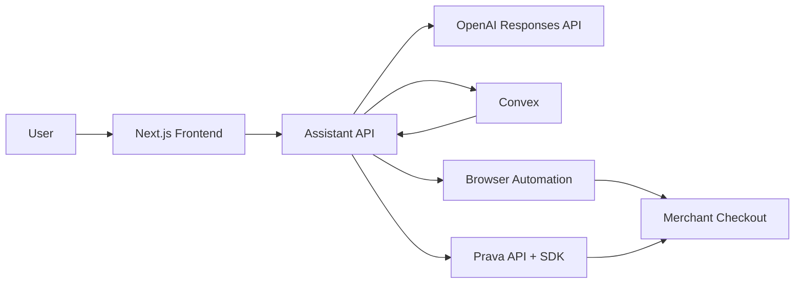

# Penny

Penny is an autonomous AI commerce assistant powered by Prava. It is not a shopping chatbot. It discovers products, compares options, creates a Purchase Intent, requests approval, authenticates through Prava, executes checkout, and returns a receipt.

## Stack

- Next.js 15 + TypeScript + Tailwind
- Convex for persistent agent and commerce data
- OpenAI Responses API for intent extraction
- LangGraph-ready workflow layer
- Playwright for browser automation
- Prava SDK + API client for intent-based payments

## Prava integration

The app uses the official Prava SDK package `@prava-sdk/core` for secure card collection flows and a dedicated server-side client in `src/lib/prava/client.ts` for all API communication.

Required environment variables:

- `PRAVA_API_KEY`
- `PRAVA_SECRET_KEY`
- `PRAVA_PUBLISHABLE_KEY`
- `PRAVA_BASE_URL`
- `PRAVA_IFRAME_URL`
- `PRAVA_ENV`

Prava authentication uses the documented `Api-Key: <YOUR_API_KEY>` header. Sandbox and production use separate base URLs and credentials.

## Local setup

1. Copy `.env.example` to `.env.local` and fill in your OpenAI, Convex, and Prava values.
2. Run `npx convex dev` in one terminal.
3. Run `npm run dev` in another terminal.

## Production deployment

- Frontend: deploy the Next.js app to Vercel.
- Backend: deploy Convex with `npx convex deploy`.
- Secret management: store all Prava and OpenAI credentials only in environment variables.

## Architecture

## Notes

- No card numbers are stored.
- All purchases require explicit approval.
- All transactions route through Prava and remain auditable.
